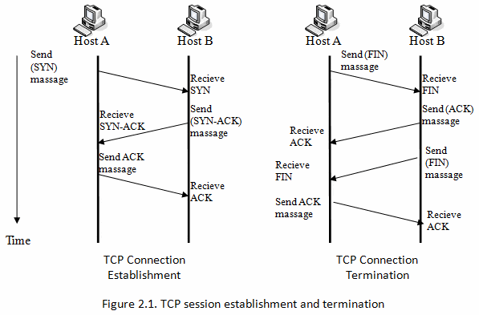

# 2번 문제
`TCP` 와 `UDP` 의 차이를 작성해주세요.

## TCP/UDP
- 네트워크에서 통신이 일어나는 과정을 7단계 혹은 4단계로 나눌 수 있는데, 이를 OSI 7계층 혹은 4계층이라 말한다.
  

- 그 중 전송(transport) 계층은 송신자와 수신자를 연결하는 통신 서비스를 제공한다.

- 해당 계층에서 데이터를 전달할 때 사용하는 프로토콜이 TCP와 UDP이다.

## TCP (Transmission Control Protocol)
- 신뢰성 있는 데이터 전송을 지원하는 <strong>연결 지향형 프로토콜</strong>이다.

- 일반적으로 IP와 함께 사용하며, IP가 데이터의 전송을 처리한다면, TCP는 패킷 추적 및 관리를 하게 된다.

- 데이터의 전송 순서를 보장하며, 신뢰성 있는 데이터를 전송한다.

- TCP는 3 Way-Handshake라는 과정을 통해 연결 후 통신을 시작하는데, 흐름 제어와 혼잡 제어를 지원하며 데이터의 순서를 보장한다.

- 4 Way-Handshake를 통해 연결을 해제한다.
> <strong>패킷(packet)</strong>
>
> 인터넷 내에서 데이터 전송을 위한 라우팅을 효율적으로 하기 위해 나누어진 조각들을 뜻한다.

### TCP의 단점
- 데이터를 보내기 전 반드시 연결되어야 하며, 1:1 통신만 가능

- 상대적으로 UDP보다 전송 속도가 느리다.

### 3 Way-Handshake
- 데이터를 전송하기 전에 먼저 정확한 전송을 보장하기 위해 상대방 컴퓨터와 사전에 세션을 수립하는 과정을 의미한며, 이 과정에서 시간이 가장 많이 소요된다.
  

- SYN(synchronize sequence numbers) - 연결 확인을 보내는 무작위의 숫자 값

- ACK(acknowledgements) - Client 혹은 Server로부터 받은 SYN에 1을 더해 SYN을 잘 받았다는 ACK

 

## UDP (User Datagram Protocol)

- 정보를 보내다는 신호나 받는다는 신호 절차 없이 일방적으로 데이터를 전달하는 <strong>비연결형 프로토콜</strong>이다.

- TCP와 다르게 연결 설정이 없으며, 혼잡 제어를 하지 않기 때문에 전송 속도가 빠르다.

- 패킷 오버헤드가 적어 네트워크 부하가 감소한다.

- 1:1, 1:N, N:N이 모두 가능하며, 실시간 서비스(streaming)에 자주 사용된다.

### UDP의 단점
- 데이터 전송에 대한 보장을 하지 않기 때문에 패킷 손실이 발생할 수 있다.
  
- 데이터를 순차적으로 보내더라도 순서가 바뀔 수 있다.

 

---
### 참고
https://tgyun615.com/60 
https://velog.io/@devharrypmw/TCPUDP-TCP%EC%99%80-UDP%EC%9D%98-%ED%8A%B9%EC%A7%95%EA%B3%BC-%EC%B0%A8%EC%9D%B4 
https://mindnet.tistory.com/entry/%EB%84%A4%ED%8A%B8%EC%9B%8C%ED%81%AC-%EC%89%BD%EA%B2%8C-%EC%9D%B4%ED%95%B4%ED%95%98%EA%B8%B0-22%ED%8E%B8-TCP-3-WayHandshake-4-WayHandshake 
https://dev-coco.tistory.com/144
https://bunny.net/academy/network/what-is-user-datagram-protocol-udp-and-how-does-it-work/