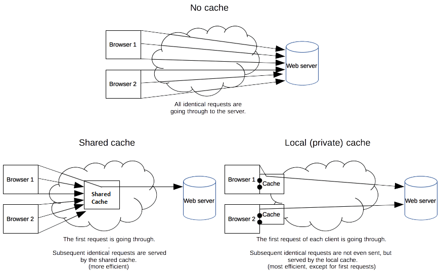

# 3번 문제
웹 브라우저에 `네이버` 를 검색하고 화면에 네이버 화면이 출력이 될 때 까지 내부적으로 어떤 동작들이 수행이 되는지 설명해주세요.

## 1. Redirect
- 서버에 리다이렉트가 존재하면 리다이렉트를 진행, 존재하지 않는다면 해당 요청에 대한 과정 진행

## 2. Caching 
- 캐시(Cache)란 자주 사용하는 데이터나 값을 미리 복사해 놓는 임시 장소를 가리키며, 원래 데이터를 접근하는 시간이 오래 걸리는 경우에 사용한다.

- 해당 요청에 대한 캐싱 가능여부 확인 후, 캐싱된 값이 존재하면 해당 값을 반환하고, 존재하지 않는다면 다음 단계 진행한다.

### 2-1. 브라우저 캐시(Browser Cache)
- 브라우저 캐시는 쿠키, 로컬 스토리지 등을 포함한 캐시이며, 개인 캐시(private cache)라고도 한다.

- 브라우저에 의해 내부 디스크에 저장하며, 캐시된 리소스를 공유하지 않는 한 개인에 한정된 캐시이다.
### 2-2. 공유 캐시(Shared Cache)
- 공유 캐시는 클라이언트와 서버 사이에 있으며 사용자 간 공유할 수 있는 응답을 저장할 수 있다.

- 대표적인 예로는 프록시 서버(Proxy server)가 존재하며, 이를 리버스 프록시를 둬서 내부 서버로 포워드한다고도 말한다.

## 3. DNS(Domain Name System)
- DNS는 계층적인 도메인 구조와 분산된 데이터베이스를 이용한 시스템으로 FQDN을 인터넷 프로토콜인 IP로 바꿔주거나, 그 반대의 작업을 수행하는 시스템이다.

- DNS 쿼리가 오면 오른쪽부터 역순으로 주소를 찾아 매핑한다.

> <strong>FQDN(Fully Qualified Domain Name)</strong> 
> 
> 호스트와 도메인이 합쳐진 완전한 도메인 이름으로, 절대 도메인 네임이라고도 한다. 
> 예를 들어 www.naver.com에서 www은 호스트, naver.com은 도메인을 의미하며, 이를 합치면 FQDN이 된다.

#### 3-1. DNS Caching
- 미리 해당 도메인이름을 요청했다면 로컬 PC에 자동으로 저장된다.
- 브라우저 캐싱과 OS 캐싱이 존재한다.

## 4. IP 라우팅(IP Routing)
- 해당 IP를 기반으로 라우팅, ARP 과정을 거쳐 실제 서버를 찾는다.
> <strong>주소 결정 프로토콜(Address Resolution Protocol)</strong>
>
> 네트워크 상에서 IP 주소를 물리적 네트워크 주소로 대응(bind)시키기 위해 사용되는 프로토콜이다.

## 5. TCP 연결
- 서버의 IP주소로 TCP Socket을 열어 통신 준비를 진행한다.

- 브라우저가 TCP 3 Way-Handshake 및 SSL 연결 등을 통해 연결을 설정

- 이후 요청을 보낸 후 요청을 전달한 서버로부터 응답을 받는다.

## 6. Contents Download
- 요청한 컨텐츠를 서버로부터 다운받는다.

- 위 과정을 모두 거친 후 처음 다운로드를 시작할 때를 TTFB(Time to First Byte)라고 한다.

## 7. Browser Rendering
- 받은 데이터를 통해 브라우저 엔진이 브라우저 렌더링 과정을 거쳐 화면을 만들어 사용자에게 출력한다.

 

---
### 참고
https://www.youtube.com/watch?v=YahjHM9UNCA
 
http://man.hubwiz.com/docset/HTTP.docset/Contents/Resources/Documents/developer.mozilla.org/en-US/docs/Web/HTTP/Caching.html
 
https://nesoy.github.io/articles/2018-06/What-happens-search-google