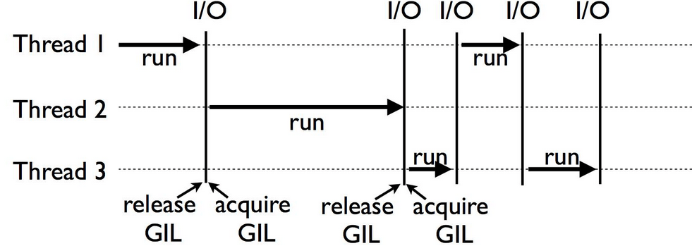

# 4번 문제
본인이 주력으로 사용하는 언어에서 설계적 결함 한 가지를 작성해주세요.

## Python의 기본적인 특징
- 1990년 암스테르담의 귀도 반 로섬(Guido van rossum)이 개발한 인터프리터 언어이다.

- 간결하고 쉬운 문법으로 배우기가 쉽고, 개발이 빠르다.

> <strong>인터프리터(Interpreter) 언어</strong>
>
> 소스 코드를 한 줄씩 해석한 후 그때그때 실행해 결과를 바로 확인할 수 있는 언어다.

## Python의 설계적 결함
### 1. GIL(Global Interpreter Lock)란?
- 파이썬 인터프리터가 한 스레드만 하나의 바이트코드를 실행 시킬 수 있도록 해주는 mutex다.

- 이는 하나의 스레드만 실행 할 수 있기 때문에 CPU 바인딩 코드와 다중 스레드 코드에서 성능 병목 현상이 발생할 수 있습니다.

### 2. GIL을 사용하게 된 이유
- 파이썬은 운영체제 스레드 개념이 없던 시절부터 존재했는데, 개발을 더 빠르게 하기 위해 쉽게 설계 되었다.
- 파이썬은 CPython이라는 참고 구현체로 구현되었는데, 그 과정에서 C언어의 모듈들을 사용하기 위해 GIL을 사용하게 되었다.
- 파이썬은 기본적으로 thread safe하지 않은 garbage collection을 사용하는데, 다중스레드가 발생하면 메모리 할당 순서가 꼬이게 된다.

### 3. GIL은 무조건 느린가?
- GIL은 스레드가 I/O 작업을 실행하는 동안에는 다른 스레드가 cpu 동작을 동시에 실행할 수 있다. 따라서 cpu 동작이 많지 않고 I/O동작이 더 많은 프로그램에서는 속도의 이점을 얻을 수 있다.

---
### 참고
https://www.linode.com/docs/guides/pros-and-cons-of-python/
 
https://wikidocs.net/6
 
https://realpython.com/python-gil/
 
https://www.datacamp.com/tutorial/python-global-interpreter-lock#rdl
 
https://velog.io/@miracle-21/PYTHONGIL-Multi-Thread